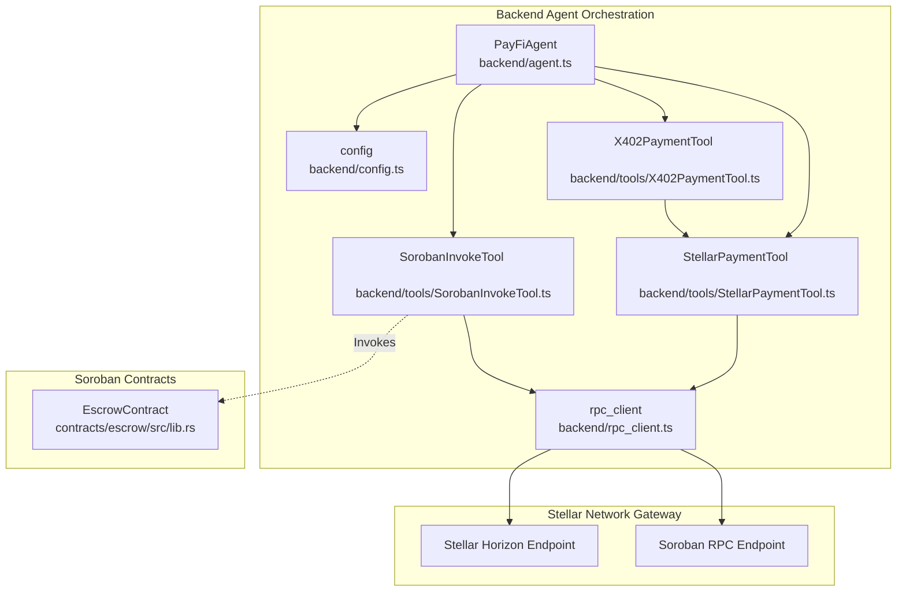
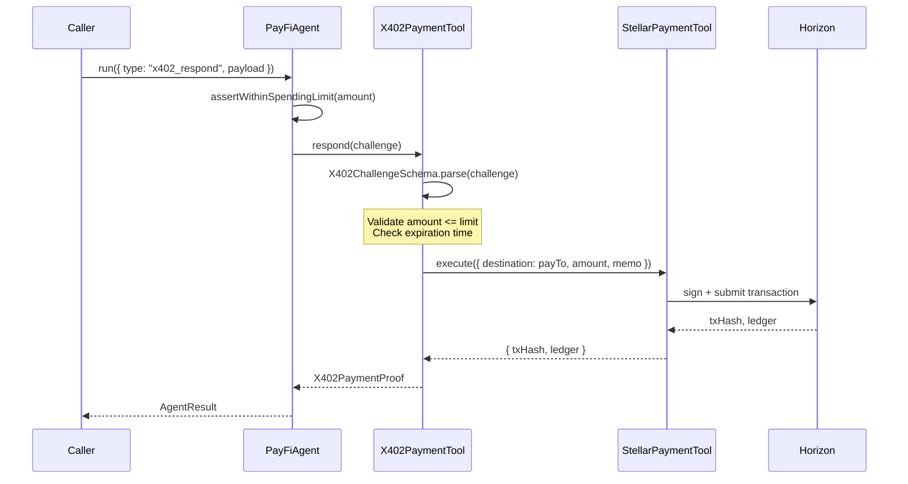

# Nodal AI System Architecture

This document provides a deep dive into the architecture of Nodal AI, explaining the core components, transaction lifecycles, security gates, and tool dispatch flows.

---

## Directory Structure Rationale

Nodal AI is structured into three clean pillars to isolate concerns, simplify development, and optimize security:

```text
/
├── backend/            # Pillar 1: Agent Orchestration (TypeScript/Node.js)
│   ├── db/             # Local database layers / state tracking
│   ├── tools/          # Individual agent tools (StellarPaymentTool, SorobanInvokeTool, X402PaymentTool)
│   ├── types/          # Domain-specific type and schema validation definitions
│   ├── agent.ts        # The main orchestrator class (PayFiAgent)
│   ├── config.ts       # Secure configuration layer and environment schema validations
│   └── rpc_client.ts   # Central network gateway with observability, retries, and simulation gates
├── contracts/          # Pillar 2: Soroban Smart Contracts (Rust)
│   └── escrow/         # Production-grade Soroban escrow contract (src/lib.rs, src/test.rs)
└── tests/              # Pillar 3: Integration & E2E Tests (Vitest & TypeScript)
    ├── payment.test.ts # Stellar native/asset payment verification tests
    ├── x402.test.ts    # E2E x402 protocol integration tests
    └── soroban_invoke.test.ts # Smart contract invocation tests
```

- **`backend/`** holds the "Agent Brain." Code here handles configuration parsing, validation, task dispatching, and cryptographic credentials signing without storing keys in memory properties.
- **`contracts/`** defines the on-chain business logic using Soroban. Contracts are compiled into WebAssembly (`.wasm`) targets.
- **`tests/`** ensures E2E compatibility by spinning up isolated transaction sequences and verifying agent interaction against mock or live network endpoints.

---

## Component Dependency Diagram

The following Mermaid diagram shows the components and the flow of dependencies across the agent, tools, network client, and smart contracts:



---

## PayFiAgent Dispatch Flow

The entry point for all agent tasks is `PayFiAgent.run(task)` inside [backend/agent.ts](file:///Users/owner/Documents/Code/drip/Nodal-AI/backend/agent.ts). The orchestrator handles task routing, enforces spending limits, and manages execution lifecycles:

```
[ Caller ] 
    │
    │  run(task)
    ▼
[ PayFiAgent.run ] ────► [ assertWithinSpendingLimit ] 
    │                         (Checks AGENT_SPENDING_LIMIT & MAINNET_SPENDING_CAP)
    │
    ├─► "stellar_payment" ──► StellarPaymentTool.execute()
    ├─► "soroban_invoke"  ──► SorobanInvokeTool.execute()
    └─► "x402_respond"    ──► X402PaymentTool.respond()
```

1. **Task Request**: The caller calls `agent.run({ type, payload })`.
2. **Spending Guard**: If the task involves a payment (`stellar_payment` or `x402_respond`), `assertWithinSpendingLimit(amount)` is called to verify that the value does not exceed the configured `AGENT_SPENDING_LIMIT` in [backend/config.ts](file:///Users/owner/Documents/Code/drip/Nodal-AI/backend/config.ts) or the global `MAINNET_SPENDING_CAP` (10,000 USDC/XLM).
3. **Tool Delegation**: The agent delegates processing to the appropriate tool class instance (`paymentTool`, `sorobanTool`, or `x402Tool`).
4. **Tool Execution**: The tool uses `config.agentKeypair()` to sign transaction envelopes and submits them via [backend/rpc_client.ts](file:///Users/owner/Documents/Code/drip/Nodal-AI/backend/rpc_client.ts).
5. **Event Emission**: On completion or failure, the agent emits either `task:complete` or `task:failed` events.

---

## The Mandatory Simulation Gate

To prevent lost fees and broadcast failures, all Soroban contract transactions must pass through a simulation gate prior to network submission. This logic is centered in [backend/rpc_client.ts](file:///Users/owner/Documents/Code/drip/Nodal-AI/backend/rpc_client.ts) inside the `prepareSorobanTx` function:

```
[ Transaction built with BASE_FEE ]
                 │
                 ▼
     [ simulateSorobanTx(tx) ] ── (Queries Soroban RPC) ──► [ simResult ]
                 │                                               │
                 ▼                                               ▼
      Is simulation an error? ◄───────────────────────── rpc.Api.isSimulationError?
         /           \
       YES            NO
       /                \
[ Throw Error ]      [ rpc.assembleTransaction(tx, simResult).build() ]
                      (Adds footprints, footprint fees, & resource bounds)
```

1. **Simulation Query**: `simulateSorobanTx(tx)` invokes the `simulateTransaction` RPC endpoint.
2. **Result Verification**: `rpc.Api.isSimulationError(simResult)` checks if transaction execution failed (e.g. invalid arguments, auth failure, or budget exhaustion). If true, it throws an error immediately.
3. **Footprint Assembly**: `rpc.assembleTransaction` merges the simulation footprint data (specifying read/write storage keys) and resource fees back into the original transaction envelope.
4. **Broadcast Readiness**: The returned fully-assembled transaction can then be signed by the caller and safely broadcast to the network.

---

## Escrow Lifecycle State Machine

The smart contract in [contracts/escrow/src/lib.rs](file:///Users/owner/Documents/Code/drip/Nodal-AI/contracts/escrow/src/lib.rs) manages locked token deposits and restricts access using a 3-state state machine:

```
    [ Uninitialized ]
           │
           │  initialize() (Depositor transfers funds, stores keys)
           ▼
       [ Active ]
         ╱    ╲
        ╱      ╲  refund() (Depositor reclaims after expiry time)
       ╱        ╲
      ╱          ▼
     │       [ Settled ] (Funds returned to depositor)
     │
     │  release() (Arbiter releases to recipient)
     ▼
 [ Settled ] (Funds sent to recipient)
```

- **`Uninitialized`**: The contract storage has no `DataKey::Depositor` key. Calling any function other than `initialize` will panic.
- **`Active`**: The contract is initialized. Funds are held in the contract account. `Released` key is `false`.
- **`Settled`**: Settled state where the `Released` key is updated to `true`. This prevents subsequent releases or refunds (preventing double-spend).

---

## x402 Challenge-Response Flow

Nodal AI implements the `x402` payment protocol via `X402PaymentTool.ts` to allow autonomous payment responses for gated resource challenges:



- **Challenge Parsing**: The response payload must match the `X402ChallengeSchema` (valid URL `resource`, `amount`, `payTo` address, `nonce` UUID, and `expiresAt` datetime).
- **Nonce-to-Memo Truncation**: Because Stellar memos are limited to 28 bytes while UUIDs are 36 characters, the tool truncates the UUID nonce to fit the memo: `challenge.nonce.slice(0, 28)`.
- **Proof Return**: On successful payment, the tool returns an `X402PaymentProof` holding the original challenge `nonce`, the settled `txHash`, the `payer` G-address, and metadata, which the resource server can inspect and verify.
